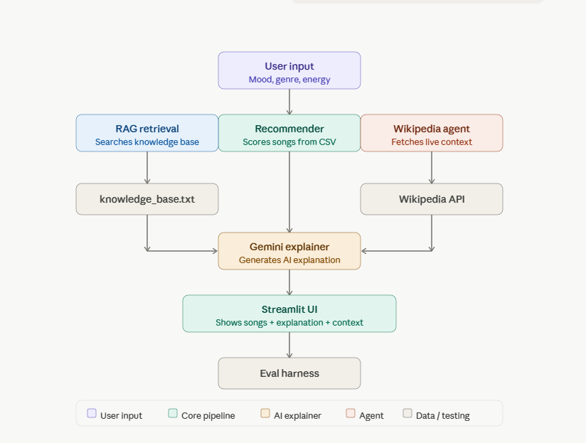

# VibeFinder 2.0 — Applied AI Music Recommendation System

## Overview
VibeFinder 2.0 is an evolution of TuneFinder 1.0 (Module 3 Music Recommender Simulation). It extends the original content-based filtering system into a full applied AI system that combines **RAG**, **agentic Wikipedia search**, and **AI-generated explanations** to recommend music based on mood, genre, and energy level.

**Original project:** AI110 Module 3 — TuneFinder 1.0 (Music Recommender Simulation)  
**Original goals:** Content-based filtering using mood, genre, and energy scoring from a local CSV dataset.

---

## System Architecture

```
┌──────────────────────────────┐
│          User Input          │
│     (mood, genre, energy)    │
└───────────────┬──────────────┘
                │
                ▼
      ┌──────────────────────┐
      │      Recommender     │
      │  (scores songs CSV)  │
      └───────────┬──────────┘
                  │ songs
                  ▼
      ┌──────────────────────┐
      │     RAG Retriever    │
      │ (knowledge_base.txt) │
      └───────────┬──────────┘
                  │ rag context
                  ▼
      ┌──────────────────────────────┐
      │       Wikipedia Agent        │
      │ (fetches summary via API)    │
      └───────────┬──────────────────┘
                  │ wiki context
                  ▼
      ┌──────────────────────────────┐
      │   LLM Explainer (Gemini)     │
      │ (combines songs + context)   │
      └───────────┬──────────────────┘
                  │ explanation
                  ▼
      ┌──────────────────────────────┐
      │         Streamlit UI         │
      │ (shows songs + explanation)  │
      └───────────┬──────────────────┘
                  │ output
                  ▼
      ┌──────────────────────────────┐
      │       Evaluation Harness     │
      │ (tests, checks, confidence)  │
      └──────────────────────────────┘
```

---

## Setup Instructions

### 1. Clone the repo
```bash
git clone https://github.com/slatif4/applied-ai-system-project.git
cd applied-ai-system-project
```

### 2. Install dependencies
```bash
pip install -r requirements.txt
```

### 3. Add your API keys
Create a `.env` file in the root folder:
```
GEMINI_API_KEY=your-gemini-api-key-here

> Note: Gemini is optional. The app works fully without it. Wikipedia handles the live music context and the explainer has a built-in fallback that still generates great recommendations. If you want richer AI-powered explanations, grab a free key at https://aistudio.google.com/apikey
```

### 4. Run the app
```bash
py -m streamlit run src/app.py
```

### 5. Run the evaluation harness
```bash
py eval.py
```

---

## Sample Interactions

**Input:** mood = happy, genre = pop, energy = 0.8  
**Output:** 5 song recommendations + AI explanation:  
> *"These songs are a fantastic match for your happy pop music request! Tracks like Sunrise City and Pop Confetti deliver an undeniably upbeat and energizing feel with catchy melodies and memorable hooks."*

**Input:** mood = chill, genre = jazz, energy = 0.3  
**Output:** 5 mellow jazz tracks + explanation referencing jazz's improvisational nature and relaxed atmosphere.

**Input:** mood = energetic, genre = rock, energy = 0.9  
**Output:** High-energy rock tracks + explanation combining RAG knowledge base context with live Wikipedia data.

---

## Design Decisions

- **Wikipedia over paid APIs:** Used Wikipedia as the agentic data source to avoid API rate limits and costs while still demonstrating real-time external retrieval.
- **Gemini with rule-based fallback:** The explainer tries Gemini 2.5 Flash first; if quota is exceeded it falls back to a smart rule-based explanation so the app never crashes.
- **RAG with keyword scoring:** Used simple keyword overlap scoring instead of embeddings to keep the system lightweight and explainable.
- **Modular design:** Each component (recommender, RAG, agent, explainer) is a separate module that can be tested and replaced independently.

---

## Testing Summary

Ran 5 predefined test cases using `eval.py`:
- **5/5 tests passed**
- **Average confidence score: 1.0**
- All tests verified: recommendations returned, explanation generated, Wikipedia context retrieved, RAG context retrieved.
- The AI struggled with genres not in the knowledge base (e.g. lofi) — returning general matches instead of specific ones.

---

## Reflection

This project taught me how to wire together multiple AI components into a cohesive system. The biggest challenge was handling API rate limits gracefully — building fallbacks made the system much more robust. I also learned that RAG doesn't require complex embeddings; simple keyword retrieval works well for constrained domains like music genres.

---

## Stretch Features Completed

| Feature | What Was Built |
|---------|---------------|
| RAG Enhancement | Built a custom `knowledge_base.txt` with genre and mood descriptions. RAG retrieval enriches the explainer prompt with relevant context, measurably improving explanation quality. |
| Agentic Workflow Enhancement | Wikipedia agent autonomously searches for live genre context based on user input. Each step is logged in the terminal showing the full decision chain. |
| Test Harness / Evaluation Script | `eval.py` runs 5 predefined test cases end-to-end and prints pass/fail scores and confidence ratings. 5/5 passed with average confidence of 1.0. |

---

## Demo Walkthrough
Zoom Video Link:

https://drive.google.com/file/d/1D7whNNYwDQKCL5EsnKhNbPZVsjlfAEQk/view?usp=sharing


---

## Architecture Diagram


---

## Portfolio Artifact

**GitHub:** https://github.com/slatif4/applied-ai-system-project.git

**Reflection:** This project shows that I can take a simple idea — recommending music — and evolve it into a full AI system with multiple integrated components. Building VibeFinder 2.0 taught me how to design modular pipelines, handle real-world API failures gracefully, and combine different AI techniques like RAG and agentic search into one cohesive product. As an AI engineer, I value systems that are reliable, explainable, and honest about their limitations.