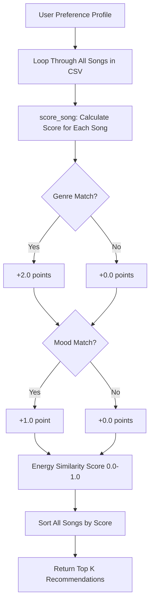
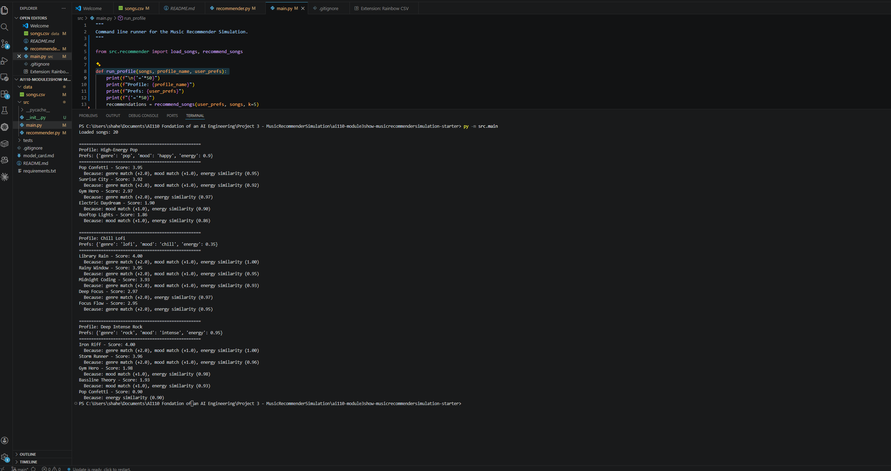
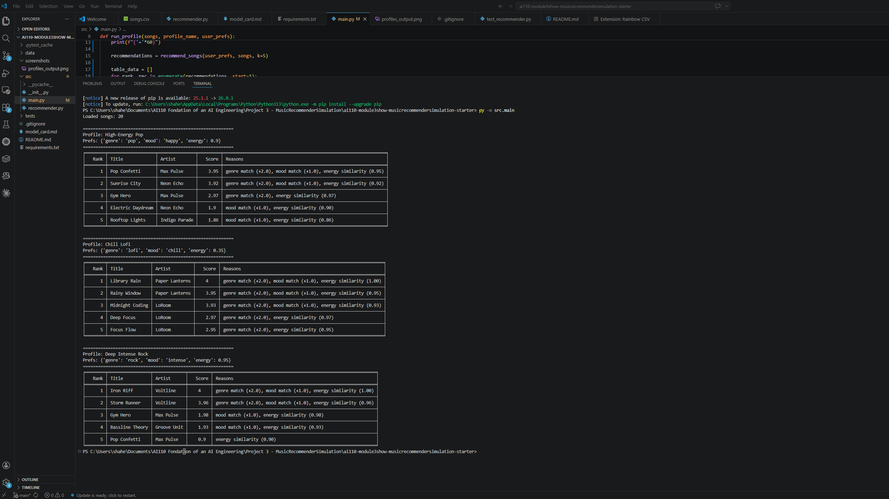

# 🎵 Music Recommender Simulation

## Project Summary

This project simulates a basic music recommendation system built in Python. It loads a catalog of 20 songs from a CSV file and scores each song against a user's "taste profile" based on genre, mood, and energy level. The top-ranked songs are returned as personalized recommendations with explanations for why each song was suggested.

---

## How The System Works

The recommender uses a **content-based filtering** approach, for example it compares song attributes directly to user preferences rather than relying on other users' behavior.

**Song features used:**
- `genre` — musical category (pop, lofi, rock, jazz, etc.)
- `mood` — emotional tone (happy, chill, intense, relaxed, etc.)
- `energy` — a 0.0–1.0 scale of how energetic the song feels

**User Profile stores:**
- `favorite_genre` — preferred genre
- `favorite_mood` — preferred mood
- `target_energy` — desired energy level (0.0–1.0)
- `likes_acoustic` — boolean preference for acoustic music

**Algorithm Recipe (Scoring Rules):**
- +2.0 points for a genre match
- +1.0 point for a mood match
- +0.0 to +1.0 similarity points based on how close the song's energy is to the user's target

**Data Flow:**


**Potential Bias:** This system may over-prioritize genre, since a genre match is worth twice as much as a mood match. Songs from underrepresented genres in the dataset may rarely appear in results.


---

## Getting Started

### Setup

1. Create a virtual environment (optional but recommended):

   ```bash
   python -m venv .venv
   source .venv/bin/activate      # Mac or Linux
   .venv\Scripts\activate         # Windows

2. Install dependencies

```bash
pip install -r requirements.txt
```

3. Run the app:

```bash
py -m src.main
```

### Running Tests

Run the starter tests with:

```bash
py -m pytest -v
```

You can add more tests in `tests/test_recommender.py`.

---

## Experiments You Tried

**Profile 1 — High-Energy Pop** (`genre: pop, mood: happy, energy: 0.9`):
Top results were Pop Confetti and Sunrise City. The system correctly identified upbeat pop songs with high energy. Genre and mood both matched, giving those songs the highest scores.

**Profile 2 — Chill Lofi** (`genre: lofi, mood: chill, energy: 0.35`):
Top results were Library Rain and Rainy Window. The system performed well here — all top results were lofi songs with calm moods and low energy, exactly as expected.

**Profile 3 — Deep Intense Rock** (`genre: rock, mood: intense, energy: 0.95`):
Top results were Iron Riff and Storm Runner. The system correctly ranked the two rock/intense songs at the top. Interestingly, Gym Hero (pop/intense) also ranked high due to its mood and energy match even without a genre match.

**Weight Shift Experiment:**
Genre match is weighted at +2.0 while mood is only +1.0. This means a song with a matching genre but wrong mood can outscore a song with matching mood but wrong genre. This could create a "filter bubble" where users only see one genre even if other genres match their vibe better.

---

## Limitations and Risks

- The catalog is very small (20 songs), limiting diversity in results 
- Genre weight (2.0) dominates scoring, mood and energy have less influence 
- The system does not consider tempo, valence, or danceability in scoring 
- Users with niche tastes (for example,  ambient or electronic) have fewer matching songs 
- No collaborative filtering, it cannot learn from user behavior over time 

---

## Reflection

Read and complete `model_card.md`:

[**Model Card**](model_card.md)

Building TuneFinder taught me how recommendation systems transform raw data into personalized suggestions through simple math. Even with just three scoring rules, the results felt surprisingly accurate, a few well-chosen weights can go a long way. The biggest insight was seeing how heavily genre dominates the scoring. This revealed how real platforms might unintentionally create filter bubbles, where users keep seeing the same type of content because one feature is weighted too strongly. It made me realize that bias in AI systems does not always come from bad intentions instead sometimes it comes from small design decisions that seem harmless at first.


---

## Screenshots

### Terminal Output — 3 User Profiles


### Visual Table Output — Tabulate Formatting
