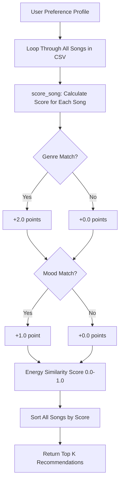

# 🎵 Music Recommender Simulation

## Project Summary

This project simulates a basic music recommendation system built in Python. It loads a catalog of 20 songs from a CSV file and scores each song against a user's "taste profile" based on genre, mood, and energy level. The top-ranked songs are returned as personalized recommendations with explanations for why each song was suggested.

---

## How The System Works

The recommender uses a **content-based filtering** approach, for example it compares song attributes directly to user preferences rather than relying on other users' behavior.

**Song features used:**
- `genre` — musical category (pop, lofi, rock, jazz, etc.)
- `mood` — emotional tone (happy, chill, intense, relaxed, etc.)
- `energy` — a 0.0–1.0 scale of how energetic the song feels

**User Profile stores:**
- `favorite_genre` — preferred genre
- `favorite_mood` — preferred mood
- `target_energy` — desired energy level (0.0–1.0)
- `likes_acoustic` — boolean preference for acoustic music

**Algorithm Recipe (Scoring Rules):**
- +2.0 points for a genre match
- +1.0 point for a mood match
- +0.0 to +1.0 similarity points based on how close the song's energy is to the user's target

**Data Flow:**


**Potential Bias:** This system may over-prioritize genre, since a genre match is worth twice as much as a mood match. Songs from underrepresented genres in the dataset may rarely appear in results.


---

## Getting Started

### Setup

1. Create a virtual environment (optional but recommended):

   ```bash
   python -m venv .venv
   source .venv/bin/activate      # Mac or Linux
   .venv\Scripts\activate         # Windows

2. Install dependencies

```bash
pip install -r requirements.txt
```

3. Run the app:

```bash
py -m src.main
```

### Running Tests

Run the starter tests with:

```bash
py -m pytest -v
```

You can add more tests in `tests/test_recommender.py`.

---

## Experiments You Tried

**Profile 1 — High-Energy Pop** (`genre: pop, mood: happy, energy: 0.9`):
Top results were Pop Confetti and Sunrise City. The system correctly identified upbeat pop songs with high energy. Genre and mood both matched, giving those songs the highest scores.

**Profile 2 — Chill Lofi** (`genre: lofi, mood: chill, energy: 0.35`):
Top results were Library Rain and Rainy Window. The system performed well here — all top results were lofi songs with calm moods and low energy, exactly as expected.

**Profile 3 — Deep Intense Rock** (`genre: rock, mood: intense, energy: 0.95`):
Top results were Iron Riff and Storm Runner. The system correctly ranked the two rock/intense songs at the top. Interestingly, Gym Hero (pop/intense) also ranked high due to its mood and energy match even without a genre match.

**Weight Shift Experiment:**
Genre match is weighted at +2.0 while mood is only +1.0. This means a song with a matching genre but wrong mood can outscore a song with matching mood but wrong genre. This could create a "filter bubble" where users only see one genre even if other genres match their vibe better.

---

## Limitations and Risks

- The catalog is very small (20 songs), limiting diversity in results 
- Genre weight (2.0) dominates scoring, mood and energy have less influence 
- The system does not consider tempo, valence, or danceability in scoring 
- Users with niche tastes (for example,  ambient or electronic) have fewer matching songs 
- No collaborative filtering, it cannot learn from user behavior over time 

---

## Reflection

Read and complete `model_card.md`:

[**Model Card**](model_card.md)

Write 1 to 2 paragraphs here about what you learned:

- about how recommenders turn data into predictions
- about where bias or unfairness could show up in systems like this


---

## 7. `model_card_template.md`

Combines reflection and model card framing from the Module 3 guidance. :contentReference[oaicite:2]{index=2}  

```markdown
# 🎧 Model Card - Music Recommender Simulation

## 1. Model Name

Give your recommender a name, for example:

> VibeFinder 1.0

---

## 2. Intended Use

- What is this system trying to do
- Who is it for

Example:

> This model suggests 3 to 5 songs from a small catalog based on a user's preferred genre, mood, and energy level. It is for classroom exploration only, not for real users.

---

## 3. How It Works (Short Explanation)

Describe your scoring logic in plain language.

- What features of each song does it consider
- What information about the user does it use
- How does it turn those into a number

Try to avoid code in this section, treat it like an explanation to a non programmer.

---

## 4. Data

Describe your dataset.

- How many songs are in `data/songs.csv`
- Did you add or remove any songs
- What kinds of genres or moods are represented
- Whose taste does this data mostly reflect

---

## 5. Strengths

Where does your recommender work well

You can think about:
- Situations where the top results "felt right"
- Particular user profiles it served well
- Simplicity or transparency benefits

---

## 6. Limitations and Bias

Where does your recommender struggle

Some prompts:
- Does it ignore some genres or moods
- Does it treat all users as if they have the same taste shape
- Is it biased toward high energy or one genre by default
- How could this be unfair if used in a real product

---

## 7. Evaluation

How did you check your system

Examples:
- You tried multiple user profiles and wrote down whether the results matched your expectations
- You compared your simulation to what a real app like Spotify or YouTube tends to recommend
- You wrote tests for your scoring logic

You do not need a numeric metric, but if you used one, explain what it measures.

---

## 8. Future Work

If you had more time, how would you improve this recommender

Examples:

- Add support for multiple users and "group vibe" recommendations
- Balance diversity of songs instead of always picking the closest match
- Use more features, like tempo ranges or lyric themes

---

## 9. Personal Reflection

A few sentences about what you learned:

- What surprised you about how your system behaved
- How did building this change how you think about real music recommenders
- Where do you think human judgment still matters, even if the model seems "smart"

